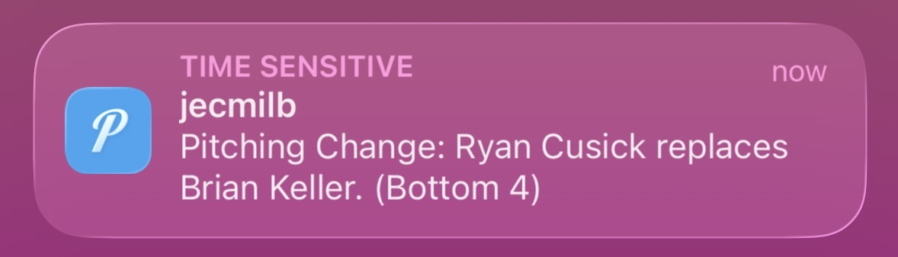

# In-Game Player Notifications

This repo will allow the user to receive push notifications to their phone when in-game substitutions occur during sporting events of their choice (currently tested on Minor League Baseball and NCAA women's basketball). Notifications can be set up for any substitutions within the chosen games, or for particular teams or players of the user's choice within those games. 

## Background and Purpose

My brother is a relief pitcher in Minor League Baseball Triple-A. They play games almost every night in season, which are streamed through the MiLB app. My family and I watch as often as we can, but often find ourselves tuning in live once he comes in to pitch mid-game. These days, it's easy to follow along with the game using the app's live play-by-play feature, and that feature also shows when he is substituted into the game to pitch. However, we are often busy with other things and can't be constantly looking at the app for this update. I want to create a way for us to be notified quickly and directly when he starts pitching, rather than having to check within the app nonstop during the game each night. 

Beyond my personal investment in setting up this project, I can see a use for other sports fans who may have a particular team or players they want to follow. I'm also a fan of the WNBA and women's college basketball, and apps like Apple Sports provide score and play-by-play push notifications directly on my lock screen, but substitution information isn't typically shown. Maybe you're watching a couple of games at once, you're working, or you're out and about, but you have a favorite pitcher or a bench player that you're excited to tune into once they're in the game. This is for you! Keep reading to set this up for yourself. 

## Process Overview

Once it's run, this pipeline does the following:
- Uses an Airflow DAG to regularly reference MiLB or NCAA game schedules in their respective config.py files and determine if a game of interest is currently happening 
- If one of the tracked games is currently happening, pulls in play-by-play game data from the ESPN or MLB APIs
- Checks the play-by-play data for information on plays of interest (for example, for MiLB games filtered to Ryan Cusick as the player of interest, the pipeline checks for plays where a pitching substitution takes place involving Ryan Cusick)
- Saves any relevant substitutions to a file to track which plays have already been notified about 
- For any new substitutions of interest, send a push notification about the substitution using the Pushover app to any configured users

### Example notification (yay, it actually works!)



## Repo Structure

```
player-notif/
├── dags/
│   ├── games_tracker_dag.py        # Airflow DAG file that triggers tasks
├── src/
│   ├── __init__.py
│   ├── shared/
│   │   ├── __init__.py
│   │   ├── notifier.py             # Shared Pushover notification function
│   │   └── scheduler.py            # Shared schedule parser/window checker
│   ├── ncaabb/
│   │   ├── __init__.py
│   │   ├── config.py               # Teams, players, and game schedule for NCAABB
│   │   └── runner.py               # ESPN API polling logic
│   └── milb/
│       ├── __init__.py
│       ├── config.py               # Teams, players, and game schedule for MiLB
│       └── runner.py               # MLB API statsapi polling logic
├── .env
├── docker-compose.yml
├── Dockerfile
└── requirements.txt
```

## Steps to run pipeline

### 1. Clone this repo to your desktop 

### Install requirements.txt 

### 2. Ongoing: Update game_schedule.py

Add the event_id, date, and times for any events you want notifications for under GAME_SCHEDULE in game_schedule.py. You can find the event_id (game_id) within the URL on the ESPN event page, which is also available prior to the game. e.g. https://www.espn.com/womens-college-basketball/game/_/gameId/401817390/notre-dame-uconn has event_id 401817390. You can add new games at any time. 

### 3. Register for Pushover API and download app

- Register your Pushover application at https://pushover.net/api and get an API token. 
- Download the Pushover app and get a user ID. If you want others to receive the same notifications, they can do the same and get user IDs as well. 

### 4. Create .env file

Create a .env file in root directory of the cloned repo with the following elements: 

- PUSHOVER_TOKEN (API token received above)
- PUSHOVER_USER (user IDs for any users who want to receive these notifications)
- SCHEDULE_TIMEZONE (time zone you used for any games added to game_schedule.py; the current schedule uses America/Chicago)
- AIRFLOW_UID (Airflow UID on your host machine)
- AIRFLOW_ADMIN_USERNAME (username for your Airflow admin account)
- AIRFLOW_ADMIN_PASSWORD (password for your Airflow admin account)
- AIRFLOW_ADMIN_FIRSTNAME (first name for your Airflow admin account)
- AIRFLOW_ADMIN_EMAIL (email for your Airflow admin account)

### 5. Install Docker if needed

Make sure you have Docker installed and open. 

### 6. Create and run Docker container 

Run the following commands in your terminal within the repo directory to initialize and start Airflow: 

```
docker compose up airflow-init    
docker compose up
```
### 7. Access Airflow

Access Airflow in browser at http://localhost:8081 with selected user and password. It should now show the DAG games_tracker. Here, you can to track DAG runs and troubleshoot any issues. 

### 8. Ongoing: Update teams/players of interest 


